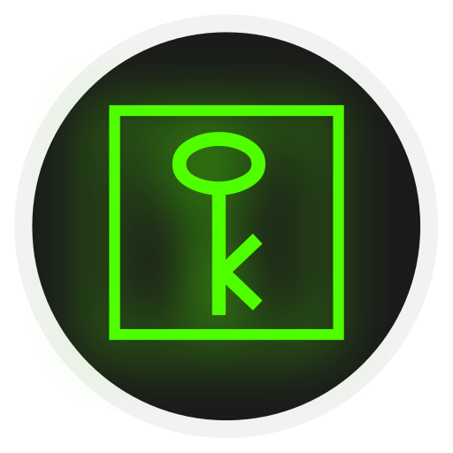
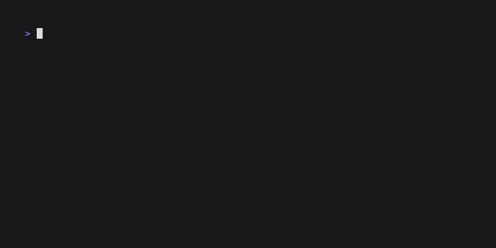

Secrecy
=======

<!-- To publish to PowerShell Gallery, commit an update to the .psd1 file -->

Secret storage manipulation utilities.

- [Export-SecretVault](https://github.com/brianary/Secrecy/wiki/Export-SecretVault): Exports secret vault content.
- [Get-SecretDetails](https://github.com/brianary/Secrecy/wiki/Get-SecretDetails): Returns secret info from the secret vaults, including metadata as properties.
- [Import-SecretVault](https://github.com/brianary/Secrecy/wiki/Import-SecretVault): Imports secrets into secret vaults.
- [Save-Secret](https://github.com/brianary/Secrecy/wiki/Save-Secret): Sets a secret in a secret vault with metadata.
